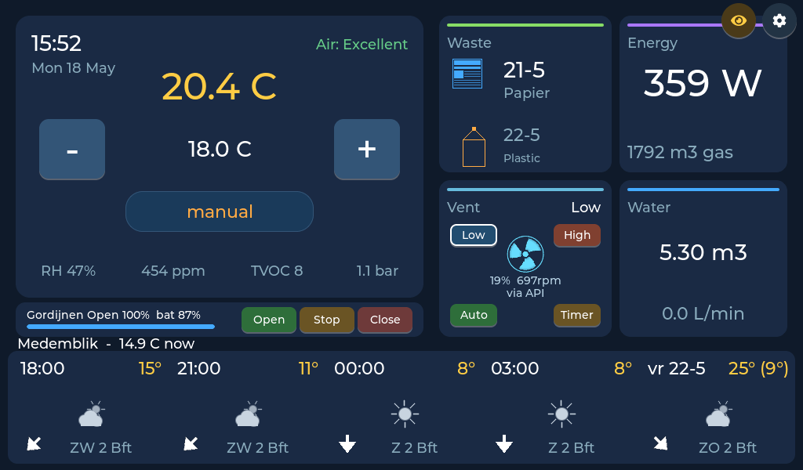

# freetoon-lvgl

A from-scratch, **on-device** UI and integration stack for the **Eneco Toon 1 / Toon 2**
smart thermostat — no cloud, no Quby login, no subscription. The stock Qt UI is replaced
with an LVGL app, and a small constellation of side processes brings the hardware back to
life (boiler, P1 meter, ventilation, weather, packages) and exposes it over a tiny
self-hosted web app so you can also drive the house from your phone.

> **This is a fork of [Ierlandfan/freetoon-lvgl](https://github.com/Ierlandfan/freetoon-lvgl)**
> (original project © Ierlandfan, MIT). It adds a Toon 1 port, unified Home Assistant +
> Domoticz + Z-Wave control, an on-device energy-statistics database, and more — see
> **[What this fork adds](#what-this-fork-adds)** and **[Credits & license](#credits--license)**.



## What this fork adds

- **Toon 1 support** — full port to the older i.MX27 hardware (800×480, 16bpp, glibc 2.21),
  alongside the existing Toon 2 (1024×600, 32bpp). One codebase, `make TARGET=toon1|toon2`.
- **Unified smart-home devices** — Home Assistant, Domoticz **and** Z-Wave lights / covers /
  switches / scenes in a single **Devices** screen (and optional on-home tiles), driven over
  WebSocket with a searchable entity picker. Manage them from Settings.
- **Energy statistics with its own database** — an on-device history recorder (5-minute ring
  for fine detail + a multi-year daily-totals store) feeding a stock-Toon-style
  **Hour / Day / Week / Month / Year** graph. Works with **any** configured source
  (HA / Domoticz / Z-Wave / built-in P1), falls back to the Toon's RRD for older history,
  shows **solar production in green**, and pages back in time with ← / →.
- **Weather** — Buienradar 5-day + 3-hourly forecast, updated for the 2026 endpoint change
  (the old `data.buienradar.nl` feed went dead).
- Plus: waste/recycling calendar, MQTT device reads, a live video tile, night-mode dimming,
  a boot picker (freetoon vs. stock qt-gui), and a multi-language UI.

## Why

Eneco discontinued cloud support for the original Toon: no app, no weather, no package
tracking, no updates. The hardware is still a perfectly capable touchscreen box with an
OpenTherm adapter, a P1-meter UART and environmental sensors — too good to shelve. This
project keeps the thermostat doing what it's good at while replacing the parts that needed
a server:

| Lost piece | Replacement |
|---|---|
| Eneco cloud UI | LVGL app on the framebuffer + an ambient "dim" screen |
| Mobile app | Self-hosted PWA served from the Toon itself |
| Weather forecast | Direct Buienradar pull |
| Energy graphs | On-device history database **+** optional P1 → MQTT → Home Assistant |
| Package tracking | IMAP → HA automation → MQTT → on-device banner |
| Ventilation control | Itho Wifi add-on REST integration |
| Schedule editor | Native LVGL screen + PWA editor |

## Build

The UI lives in `lvgl_ui_recovered/src`. You need an ARM cross-toolchain targeting
**glibc 2.21** (the path is set in the Makefile's `CC` / `SYSROOT`).

```sh
cd lvgl_ui_recovered/src

make TARGET=toon1             # Toon 1 binary  → ../build-toon1/toonui-toon1
make TARGET=toon2             # Toon 2 binary  → ../build-toon2/toonui-toon2
make TARGET=toon1 abi-check   # verify nothing newer than GLIBC_2.21 is required

make TARGET=sim1              # x86 simulator (Toon 1 config, 16bpp)
./build-sim1/toonui-sim1 home /tmp/out.ppm   # render a screen to a PPM for inspection
```

The simulator renders any named screen headless, which is handy for previewing layout
changes without a device.

## Install / update

On a rooted Toon, run the self-installer — it pulls the latest release, picks the right
binary for your model (`toonui-toon1` for Toon 1, `toonui` for Toon 2) and installs it as
`/mnt/data/toonui`, refreshes the helper scripts, takes over the GUI's `inittab` row, and
restarts the UI. Re-running is safe (idempotent):

```sh
curl -fsSL https://raw.githubusercontent.com/royka1/freetoon-lvgl/main/scripts/toon-selfinstall.sh | sh
```

A 10-second **boot picker** (also under *Settings → UI mode*) then lets you choose
`freetoon-lvgl` or the stock `qt-gui` on each boot. Rooting depends on your device; see the
[upstream project](https://github.com/Ierlandfan/freetoon-lvgl).

> Installing the release binary by hand? It must land at `/mnt/data/toonui` (that's what the
> launcher runs) — rename `toonui-toon1` → `toonui` when you copy it. The self-installer does
> this for you.

## Contributing

Issues and PRs are welcome — two GitHub **fork** quirks worth knowing:

- **Issues** — open them at
  [`royka1/freetoon-lvgl/issues`](https://github.com/royka1/freetoon-lvgl/issues).
- **Pull requests** — when you open a PR, GitHub defaults the *base repository* to the
  upstream `Ierlandfan/freetoon-lvgl`. **Change the "base repository" dropdown to
  `royka1/freetoon-lvgl` and the base branch to `main`** so your PR targets this fork.

Development happens on **`main`**. (The `User-friendly-menu` branch is frozen for an
in-flight PR to upstream — please don't base work on it.)

## Credits & license

Forked from **[Ierlandfan/freetoon-lvgl](https://github.com/Ierlandfan/freetoon-lvgl)** —
all credit to the original author for the foundation. Built on [LVGL](https://lvgl.io).

Released under the **MIT License** — © 2026 Ierlandfan and contributors. See
[`LICENSE`](LICENSE).
