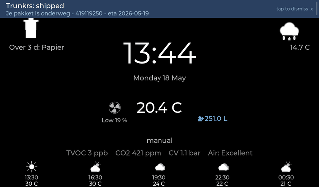
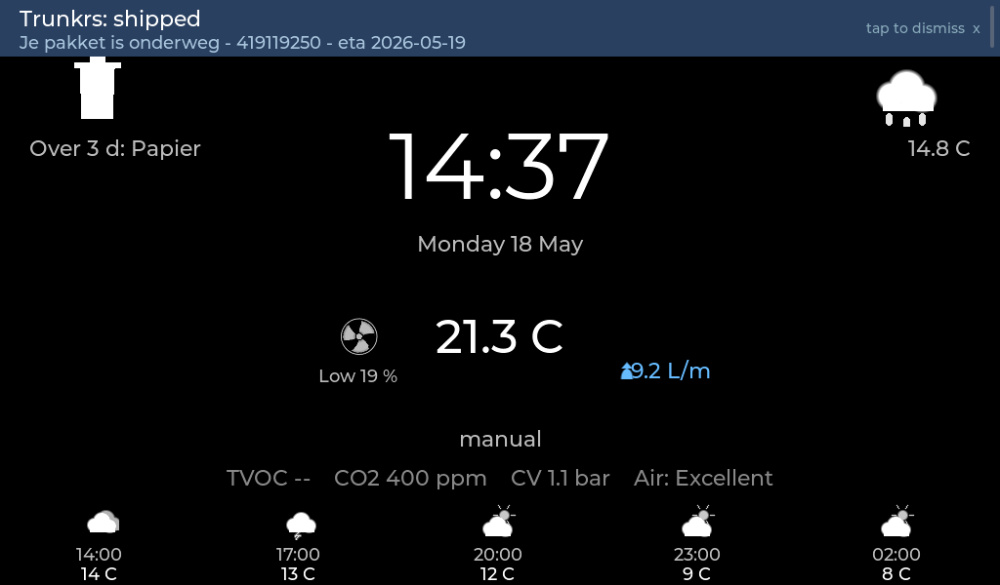

# freetoon-lvgl

A from-scratch UI and integration stack for the **Eneco Toon 1 / Toon 2** smart
thermostat that runs entirely on the device — no cloud, no Quby login, no
subscription. The stock Qt UI is replaced with an LVGL app; a small constellation
of side processes brings the hardware back to life (boiler, P1 meter, vent,
weather, packages) and exposes everything over a tiny progressive web app so
you can also drive the house from your phone.



*Live capture from the device — clock ticking, vent fan spinning, water flow & energy values updating in real time.*


## Why

Eneco discontinued cloud support for the original Toon: no more app, no more
weather, no more package tracking, no more software updates. The device itself
is a perfectly capable iMX28 box with a 1024×600 touchscreen, an OpenTherm
adapter, an i.MX P1-meter UART and a humidity/temperature sensor — too good to
land on a shelf.

`freetoon-lvgl` keeps the thermostat doing what it's good at (running OpenTherm,
modulating the boiler, reading the room) while replacing the parts that
required a server somewhere:

| Lost piece | Replacement |
|---|---|
| Eneco cloud UI | LVGL app on the framebuffer + LVGL "dim" ambient screen |
| Mobile app | Self-hosted PWA served from the Toon itself |
| Weather forecast | Direct Buienradar pull |
| Energy graphs | P1 bridge → MQTT → Home Assistant (or local view) |
| Package tracking | IMAP-driven HA automation → MQTT → on-device banner |
| Ventilation control | Itho Wifi addon REST API integration |
| Schedule editor | Native LVGL screen + PWA editor |

## What's in this repo

```
lvgl_ui_recovered/      The LVGL replacement UI
  src/
    main.c              entry point + tick/timer setup
    boxtalk.c           BoxTalk client — speaks to happ_thermstat over TCP 1337
    quby_bridge ↗       see quby_bridge/ — Quby-protocol bridge to keteladapter
    homeassistant.c     HA REST client (curtains, notify, generic)
    homewizard.c        HWE-P1 + HWE-WTR pollers
    ventilation.c       Itho Wifi addon REST client
    mqtt_client.c       Hand-rolled MQTT 3.1.1 subscriber (no libmosquitto)
    packages.c          Tap-to-dismiss banner queue, MQTT-fed
    pwa_server.c        HTTP + SSE server for the PWA on :10081
    screen_home.c       Main tile grid (heater / vent / energy / water / waste)
    screen_dim.c        Ambient screen (clock + temp + flame + forecast)
    screen_thermostat.c "Heater detail" page (OT health, boiler flow/return)
    screen_settings.c   On-device config (MQTT, weather, brightness, …)
    screen_schedule.c   Weekly Comfort/Home/Sleep/Away scheduler
    schedule.c          Read/write hcb_config schedule JSON
    healthcheck.c       /healthz endpoint + watchdog + daily restart
    settings.c          Persistent /mnt/data/toonui.cfg
    gen_icons.py        Bitmap-icon generator (flame, drop, faucet, fan,
                          radiator, weather, waste) — runs at build time
    pwa/                Built into the binary at /, served by pwa_server

quby_bridge/            Userspace bridge for keteladapter (replaces stock BA)
p1bridge/               Pushes HWE-P1 readings into hcb_rrd
ha_packages/            HA-side package-tracking automation (deploy.py)
pwa_static/             PWA shell — index.html / app.js / sw.js
scripts/                Helpers (ot_mode_switch.sh: proxy/wireless/off)
install.sh              One-shot deploy from a Linux host to a Toon
toonshot.sh             Pull /dev/fb0 over SSH → PNG (debug helper)
toontap.sh              Inject a touch event into /dev/input/event1
```

## Screens

### Home
The default LVGL screen. Big tiles for the main signals — indoor temperature
and setpoint, boiler state (with the original-Toon-style radiator+flame icon
when CH is firing), waste-collection reminders, live energy + gas, ventilation
preset + RPM, water flow, curtains. A 5-day weather forecast lives at the
bottom. Tap the heater tile for OT detail; tap the gear-corner for settings.


### Dim / ambient
After the configured idle timeout the screen drops to a near-black ambient
view: clock, indoor temperature with a small radiator+flame indicator when
the boiler is firing, vent fan spinner on the left mirroring the flame on
the right, top trash hint, top-right outdoor temperature, package banners
at the top, weather strip at the bottom.



### Heater detail
Tap the heater tile from home to see boiler-side telemetry — flow + return
water temps, modulation level, CH setpoint from the stooklijn, water
pressure, eCO₂ / TVOC / humidity. The `Advanced` button opens a full dump
of every OpenTherm DataId currently tracked by OTGW.

### PWA
Served at `http://<toon>:10081/` from the device itself. Same controls as the
LVGL screen plus a packages list with manual entry and the weekly schedule
editor. Add to Home Screen for a phone-app feel; works offline-first via a
small service worker.

## Architecture

```
                        ┌───────────────────┐
                        │   happ_thermstat  │ ← stock Toon process, untouched
                        │  (OpenTherm logic)│
                        └────────┬──────────┘
                                 │ BoxTalk (XML/NUL-framed over 127.0.0.1:1337)
                                 │ HTTP    (127.0.0.1:10080/happ_thermstat?…)
                                 ▼
┌────────────┐  Quby   ┌───────────────────────────┐    LVGL    ┌────────────┐
│keteladapter│◀──ttymxc0──▶│        toonui          │──────▶│  /dev/fb0  │
│  (boiler)  │  bridged    │   (this repo, on /mnt/ │       │  1024×600  │
└────────────┘  via       │       data/toonui)      │       └────────────┘
                quby_bridge└──┬─────┬─────┬─────┬───┘
                              │     │     │     │
                              │     │     │     └──── PWA HTTP/SSE on :10081
                              │     │     │
                              │     │     └──────── MQTT subscriber → home/packages/*
                              │     │
                              │     └──── Itho Wifi REST (vent), HWE-P1 (power/gas),
                              │           HA REST (curtains, notify), Buienradar
                              │
                              └──── Boxtalk client: setpoint, program, schedule
```

`toonui` is the only new long-running process on the device. The stock
`qt-gui` is removed from `inittab` so it can't fight for the framebuffer;
`toonui` is added with `respawn` so init brings it back on crash. Config
lives at `/mnt/data/toonui.cfg`; logs go to `/var/volatile/tmp/toonui.log`.

## Building

Cross-compile for the Toon's ARMv7 hardfloat target. The Makefile expects a
Linaro toolchain at `/tmp/qt_rebuild/linaro/`:

```bash
cd lvgl_ui_recovered/src
make            # produces ../build/toonui
```

Native build for desktop development (SDL2 driver) is also supported via the
LVGL submodule; see `src/Makefile` for the targets.

## Deploying

`install.sh` does an end-to-end install from a development host to a fresh
Toon — pulls the toolchain, builds, copies `toonui` + PWA + scripts to
`/mnt/data/`, patches `inittab`. SSH access is required (the Toon's stock
`hcb_config` flips the SSH server on via the Internals menu).

The default deploy expects:

* Toon reachable as `toon@<ip>` (default password `toon`)
* `/mnt/data/` mounted RW (it is, on stock firmware)
* A reachable MQTT broker for the packages banner and (optionally) P1 telemetry
* Home Assistant (optional, for curtain control / push notifications)

Edit `lvgl_ui_recovered/src/settings.c` defaults or `/mnt/data/toonui.cfg`
on-device to point at your own IPs.

## Status

The thermostat path is **the** path on this install — `happ_thermstat` →
`keteladapter` over the Quby protocol, with `quby_bridge` patched to mimic
the discontinued BoilerAdapter bit-for-bit. OTGW runs in GW=1 (relay) mode
and forwards the same OpenTherm frames the original BA produced, so the
boiler's CH/DHW state machines see no change from when Eneco's hardware was
in the loop. Verified by warming a 17.9 °C room to 20.0 °C unattended.

The repo is opinionated to one physical install (the author's), and parts
of the integration glue (HA entities, MQTT topic names, Itho user/password
location) are tuned to that environment. The LVGL UI and the core BoxTalk /
Quby / OTGW plumbing are portable; the per-integration screens are easy to
disable.

## Acknowledgements

* **OTGW** — Robert van den Breemen's HTTP-firmware fork of the OpenTherm
  Gateway is the boiler-side workhorse.
* **Itho Wifi** — Arjen Hiemstra's add-on board + REST API made vent control
  trivial.
* **HomeWizard** — open `/api/v1/data` on the HWE-P1 / HWE-WTR.
* **LVGL** — the embedded UI library this app is built on.
* **Toon community** — the reverse-engineering work scattered across
  hacktoon and various Tweakers threads that mapped out happ_thermstat,
  hcb_config and the Quby protocol.

## License

This repository is published for educational and personal use. It contains no
Eneco / Quby proprietary code. The stock Toon binaries (`happ_thermstat`,
`hcb_config`, `keteladapter` firmware, …) remain Eneco's; nothing in this
repo redistributes or modifies them.
